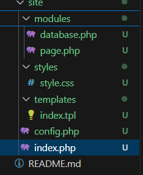
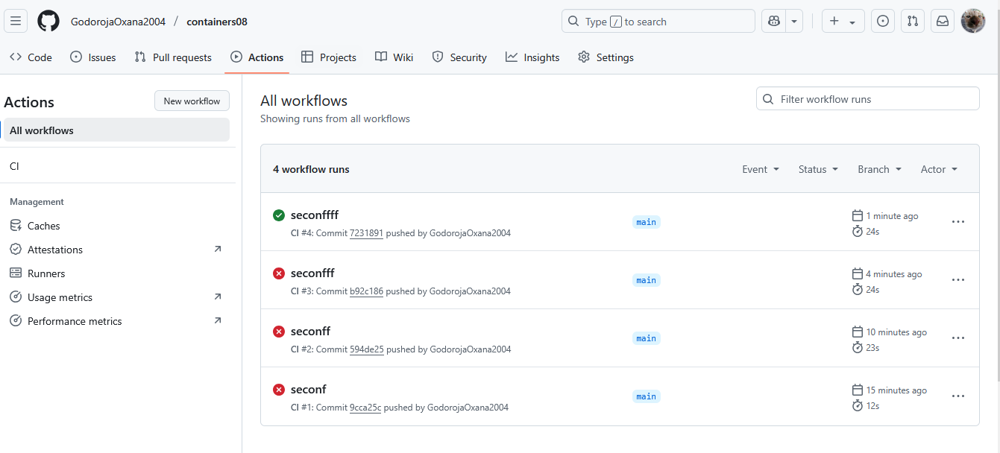

# Лабораторная работа №8: Непрерывная интеграция с помощью Github Actions

### Выполнила: Годорожа Оксана, группа I2302

## Цель работы

В рамках данной работы студенты научатся настраивать непрерывную интеграцию с помощью Github Actions.

## Задание

Создать Web приложение, написать тесты для него и настроить непрерывную интеграцию с помощью Github Actions на базе контейнеров.

## Подготовка

Для выполнения данной работы необходимо иметь установленный на компьютере [Docker](https://www.docker.com/).

## Выполнение

Создайте репозиторий `containers08` и скопируйте его себе на компьютер.


В директории `containers08` создала директорию `./site`. В директории `./site` будет располагаться Web приложение на базе PHP.


### Создание Web приложения

Создала в директории `./site` Web приложение на базе PHP со следующей структурой:

```text
site
├── modules/
│   ├── database.php
│   └── page.php
├── templates/
│   └── index.tpl
├── styles/
│   └── style.css
├── config.php
└── index.php
```



Файл `modules/database.php` содержит класс `Database` для работы с базой данных. Для работы с базой данных используйте SQLite. Класс должен содержать методы:

```php
<?php
class Database {
    private $db;

    public function __construct($path) {
        try {
            $this->db = new PDO("sqlite:" . $path);
            $this->db->setAttribute(PDO::ATTR_ERRMODE, PDO::ERRMODE_EXCEPTION);
        } catch (PDOException $e) {
            throw new Exception("Database connection failed: " . $e->getMessage());
        }
    }

    public function Execute($sql) {
        try {
            $this->db->exec($sql);
            return true;
        } catch (PDOException $e) {
            throw new Exception("Execute failed: " . $e->getMessage());
        }
    }

    public function Fetch($sql) {
        try {
            $stmt = $this->db->query($sql);
            return $stmt->fetchAll(PDO::FETCH_ASSOC);
        } catch (PDOException $e) {
            throw new Exception("Fetch failed: " . $e->getMessage());
        }
    }

    public function Create($table, $data) {
        try {
            $columns = implode(", ", array_keys($data));
            $placeholders = ":" . implode(", :", array_keys($data));
            $sql = "INSERT INTO $table ($columns) VALUES ($placeholders)";
            $stmt = $this->db->prepare($sql);
            foreach ($data as $key => $value) {
                $stmt->bindValue(":$key", $value);
            }
            $stmt->execute();
            return $this->db->lastInsertId();
        } catch (PDOException $e) {
            throw new Exception("Create failed: " . $e->getMessage());
        }
    }

    public function Read($table, $id) {
        try {
            $sql = "SELECT * FROM $table WHERE id = :id";
            $stmt = $this->db->prepare($sql);
            $stmt->bindValue(":id", $id);
            $stmt->execute();
            return $stmt->fetch(PDO::FETCH_ASSOC);
        } catch (PDOException $e) {
            throw new Exception("Read failed: " . $e->getMessage());
        }
    }

    public function Update($table, $id, $data) {
        try {
            $set = [];
            foreach ($data as $key => $value) {
                $set[] = "$key = :$key";
            }
            $set = implode(", ", $set);
            $sql = "UPDATE $table SET $set WHERE id = :id";
            $stmt = $this->db->prepare($sql);
            foreach ($data as $key => $value) {
                $stmt->bindValue(":$key", $value);
            }
            $stmt->bindValue(":id", $id);
            $stmt->execute();
            return true;
        } catch (PDOException $e) {
            throw new Exception("Update failed: " . $e->getMessage());
        }
    }

    public function Delete($table, $id) {
        try {
            $sql = "DELETE FROM $table WHERE id = :id";
            $stmt = $this->db->prepare($sql);
            $stmt->bindValue(":id", $id);
            $stmt->execute();
            return true;
        } catch (PDOException $e) {
            throw new Exception("Delete failed: " . $e->getMessage());
        }
    }

    public function Count($table) {
        try {
            $sql = "SELECT COUNT(*) as count FROM $table";
            $stmt = $this->db->query($sql);
            $result = $stmt->fetch(PDO::FETCH_ASSOC);
            return $result['count'];
        } catch (PDOException $e) {
            throw new Exception("Count failed: " . $e->getMessage());
        }
    }
}

```

- `__construct($path)` - конструктор класса, принимает путь к файлу базы данных SQLite;
- `Execute($sql)` - выполняет SQL запрос;
- `Fetch($sql)` - выполняет SQL запрос и возвращает результат в виде ассоциативного массива;
- `Create($table, $data)` - создает запись в таблице `$table` с данными из ассоциативного массива `$data` и возвращает идентификатор созданной записи;
- `Read($table, $id)` - возвращает запись из таблицы `$table` по идентификатору `$id`;
- `Update($table, $id, $data)` - обновляет запись в таблице `$table` по идентификатору `$id` данными из ассоциативного массива `$data`;
- `Delete($table, $id)` - удаляет запись из таблицы `$table` по идентификатору `$id`;
- `Count($table)` - возвращает количество записей в таблице `$table`.

Файл `modules/page.php` содержит класс `Page` для работы с страницами. Класс должен содержать методы:

```php
<?php
class Page {
    private $template;

    public function __construct($template) {
        if (!file_exists($template)) {
            throw new Exception("Template file not found: $template");
        }
        $this->template = $template;
    }

    public function Render($data) {
        $content = file_get_contents($this->template);
        foreach ($data as $key => $value) {
            $content = str_replace("{{{$key}}}", $value, $content);
        }
        return $content;
    }
}
?>
```

- `__construct($template)` - конструктор класса, принимает путь к шаблону страницы;
- `Render($data)` - отображает страницу, подставляя в шаблон данные из ассоциативного массива `$data`.

Файл `templates/index.tpl` содержит шаблон страницы.

```tpl
<!DOCTYPE html>
<html lang="en">
<head>
    <meta charset="UTF-8">
    <title>{{title}}</title>
    <link rel="stylesheet" href="styles/style.css">
</head>
<body>
    <h1>{{title}}</h1>
    <p>{{content}}</p>
</body>
</html>
```

Файл `styles/style.css` содержит стили для страницы.

```css
body {
    font-family: Arial, sans-serif;
    margin: 20px;
}
h1 {
    color: #333;
}
p {
    font-size: 16px;
}
```


Файл `index.php` содержит код для отображения страницы. Примерный код для файла `index.php`:

```php
<?php

require_once __DIR__ . '/modules/database.php';
require_once __DIR__ . '/modules/page.php';

require_once __DIR__ . '/config.php';

$db = new Database($config["db"]["path"]);

$page = new Page(__DIR__ . '/templates/index.tpl');

$pageId = $_GET['page'];

$data = $db->Read("page", $pageId);

echo $page->Render($data);
```

Файл `config.php` содержит настройки для подключения к базе данных.

```php
<?php
$config = [
    "db" => [
        "path" => "/var/www/db/db.sqlite"
    ]
];
```

### Подготовка SQL файла для базы данных

Создала в корневом каталоге директорию `./sql`. В созданной директории создала файл `schema.sql` со следующим содержимым:

```sql
CREATE TABLE page (
    id INTEGER PRIMARY KEY AUTOINCREMENT,
    title TEXT,
    content TEXT
);

INSERT INTO page (title, content) VALUES ('Page 1', 'Content 1');
INSERT INTO page (title, content) VALUES ('Page 2', 'Content 2');
INSERT INTO page (title, content) VALUES ('Page 3', 'Content 3');
```

### Создание тестов

Создала в корневом каталоге директорию `./tests`. В созданном каталоге создала файл `testframework.php` со следующим содержимым:

```php
<?php

function message($type, $message) {
    $time = date('Y-m-d H:i:s');
    echo "{$time} [{$type}] {$message}" . PHP_EOL;
}

function info($message) {
    message('INFO', $message);
}

function error($message) {
    message('ERROR', $message);
}

function assertExpression($expression, $pass = 'Pass', $fail = 'Fail'): bool {
    if ($expression) {
        info($pass);
        return true;
    }
    error($fail);
    return false;
}

class TestFramework {
    private $tests = [];
    private $success = 0;

    public function add($name, $test) {
        $this->tests[$name] = $test;
    }

    public function run() {
        foreach ($this->tests as $name => $test) {
            info("Running test {$name}");
            if ($test()) {
                $this->success++;
            }
            info("End test {$name}");
        }
    }

    public function getResult() {
        return "{$this->success} / " . count($this->tests);
    }
}
```

Создала в директории `./tests` файл `tests.php` со следующим содержимым:

```php
<?php
require_once __DIR__ . '/testframework.php';
require_once __DIR__ . '/../config.php';;
require_once __DIR__ . '/../modules/database.php';
require_once __DIR__ . '/../modules/page.php';

$testFramework = new TestFramework();

// Тест 1: Проверка подключения к базе данных
function testDbConnection() {
    global $config;
    try {
        $db = new Database($config["db"]["path"]);
        return assertExpression(true, "Database connection successful", "Database connection failed");
    } catch (Exception $e) {
        return assertExpression(false, "Database connection successful", "Database connection failed: " . $e->getMessage());
    }
}

// Тест 2: Проверка метода Count
function testDbCount() {
    global $config;
    $db = new Database($config["db"]["path"]);
    $count = $db->Count("page");
    return assertExpression($count >= 3, "Count method returned $count", "Count method failed");
}

// Тест 3: Проверка метода Create
function testDbCreate() {
    global $config;
    $db = new Database($config["db"]["path"]);
    $data = [
        'title' => 'Test Page',
        'content' => 'Test Content'
    ];
    $id = $db->Create("page", $data);
    $record = $db->Read("page", $id);
    return assertExpression(
        $record['title'] === 'Test Page' && $record['content'] === 'Test Content',
        "Create method successful",
        "Create method failed"
    );
}

// Тест 4: Проверка метода Read
function testDbRead() {
    global $config;
    $db = new Database($config["db"]["path"]);
    $record = $db->Read("page", 1);
    return assertExpression(
        $record['title'] === 'Page 1' && $record['content'] === 'Content 1',
        "Read method successful",
        "Read method failed"
    );
}

// Тест 5: Проверка метода Update
function testDbUpdate() {
    global $config;
    $db = new Database($config["db"]["path"]);
    $data = [
        'title' => 'Updated Page',
        'content' => 'Updated Content'
    ];
    $db->Update("page", 1, $data);
    $record = $db->Read("page", 1);
    return assertExpression(
        $record['title'] === 'Updated Page' && $record['content'] === 'Updated Content',
        "Update method successful",
        "Update method failed"
    );
}

// Тест 6: Проверка метода Delete
function testDbDelete() {
    global $config;
    $db = new Database($config["db"]["path"]);
    $data = [
        'title' => 'Page to Delete',
        'content' => 'Content to Delete'
    ];
    $id = $db->Create("page", $data);
    $db->Delete("page", $id);
    $record = $db->Read("page", $id);
    return assertExpression(
        $record === false,
        "Delete method successful",
        "Delete method failed"
    );
}

// Тест 7: Проверка метода Execute
function testDbExecute() {
    global $config;
    $db = new Database($config["db"]["path"]);
    $sql = "CREATE TABLE test_table (id INTEGER PRIMARY KEY)";
    $result = $db->Execute($sql);
    return assertExpression(
        $result === true,
        "Execute method successful",
        "Execute method failed"
    );
}

// Тест 8: Проверка метода Fetch
function testDbFetch() {
    global $config;
    $db = new Database($config["db"]["path"]);
    $sql = "SELECT * FROM page WHERE id = 1";
    $result = $db->Fetch($sql);
    return assertExpression(
        !empty($result) && $result[0]['title'] === 'Page 1',
        "Fetch method successful",
        "Fetch method failed"
    );
}

// Тест 9: Проверка рендеринга страницы
function testPageRender() {
    $template = __DIR__ . '/../templates/index.tpl';
    $page = new Page($template);
    $data = [
        'title' => 'Test Title',
        'content' => 'Test Content'
    ];
    $output = $page->Render($data);
    return assertExpression(
        strpos($output, 'Test Title') !== false && strpos($output, 'Test Content') !== false,
        "Page render successful",
        "Page render failed"
    );
}

// Добавление тестов в тестовый фреймворк
$testFramework->add('Database connection', 'testDbConnection');
$testFramework->add('Table count', 'testDbCount');
$testFramework->add('Data create', 'testDbCreate');
$testFramework->add('Data read', 'testDbRead');
$testFramework->add('Data update', 'testDbUpdate');
$testFramework->add('Data delete', 'testDbDelete');
$testFramework->add('Execute SQL', 'testDbExecute');
$testFramework->add('Fetch SQL', 'testDbFetch');
$testFramework->add('Page render', 'testPageRender');

// Запуск тестов
$testFramework->run();
echo $testFramework->getResult();
?>
```


### Создание Dockerfile

Создайте в корневом каталоге файл `Dockerfile` со следующим содержимым:

```dockerfile
FROM php:7.4-fpm as base

RUN apt-get update && \
    apt-get install -y sqlite3 libsqlite3-dev && \
    docker-php-ext-install pdo_sqlite

VOLUME ["/var/www/db"]

COPY sql/schema.sql /var/www/db/schema.sql

RUN echo "prepare database" && \
    cat /var/www/db/schema.sql | sqlite3 /var/www/db/db.sqlite && \
    chmod 777 /var/www/db/db.sqlite && \
    rm -rf /var/www/db/schema.sql && \
    echo "database is ready"

COPY site /var/www/html
```


### Настройка Github Actions

Создаю в корневом каталоге репозитория файл `.github/workflows/main.yml` со следующим содержимым:

```yaml
name: CI

on:
  push:
    branches:
      - main

jobs:
  build:
    runs-on: ubuntu-latest
    steps:
      - name: Checkout
        uses: actions/checkout@v4
      - name: Build the Docker image
        run: docker build -t containers07 .
      - name: Create `container`
        run: docker create --name container --volume database:/var/www/db containers07
      - name: Copy tests to the container
        run: docker cp ./tests container:/var/www/html
      - name: Up the container
        run: docker start container
      - name: Run tests
        run: docker exec container php /var/www/html/tests/tests.php
      - name: Stop the container
        run: docker stop container
      - name: Remove the container
        run: docker rm container
```


## Запуск и тестирование

Отправляем изменения в репозиторий и убеждаемся, что тесты проходят успешно. Для этого переходим во вкладку `Actions` в репозитории и дождаемся окончания выполнения задачи.



---

Ответы на вопросы:

1. **Что такое непрерывная интеграция?**  
   Непрерывная интеграция (CI) — это практика автоматической сборки, тестирования и интеграции изменений в коде при каждом коммите или создании Pull Request. CI позволяет выявлять ошибки на ранних стадиях, обеспечивая стабильность и качество кода.

2. **Для чего нужны юнит-тесты? Как часто их нужно запускать?**  

   Юнит-тесты проверяют корректность отдельных компонентов (функций, методов) приложения. Они необходимы для:  

   - Проверки правильности кода.  
   - Облегчения рефакторинга.  
   - Предотвращения регрессий.  

   Юнит-тесты следует запускать при каждом коммите, создании Pull Request и локально перед отправкой изменений.

3. **Что нужно изменить в файле `.github/workflows/main.yml`, чтобы тесты запускались при каждом создании запроса на слияние (Pull Request)?**  

   Добавить событие `pull_request` в секцию `on`:  
   ```yaml
   on:
     push:
       branches:
         - main
     pull_request:
       branches:
         - main

**Пояснение**:

- Секция `on` определяет события, которые запускают workflow.
- Добавление `pull_request` с указанием ветки `branches: - main` означает, что тесты будут выполняться при создании или обновлении Pull Request, направленного в ветку `main`.
- Убедится, что секция `on` включает оба события (`push` и `pull_request`), если нужно, чтобы тесты запускались в обоих случаях.

4. **Что нужно добавить в файл `.github/workflows/main.yml`, чтобы удалять созданные образы после выполнения тестов?**  

Добавить следующий шаг в секцию `steps` внутри `jobs.build` в файле `.github/workflows/main.yml`:


- name: Remove Docker image
  run: docker rmi containers08


**Пояснение**:
- Шаг добавляется в секцию `steps` внутри `jobs.build` в файле `.github/workflows/main.yml`.
- Команда `docker rmi containers08` удаляет Docker-образ с тегом `containers08`.
- Рекомендуется размещать этот шаг после остановки и удаления контейнера (например, после `docker rm container`), чтобы очистить все ресурсы.
- Убедится, что имя образа (`containers08`) совпадает с тем, что указано в шаге сборки (`docker build -t containers08 .`).


---

### Библиография


1. **Официальная документация PHP**.  
   PHP Manual. Доступно по: [https://www.php.net/manual/en/](https://www.php.net/manual/en/)  
   Использовалась для изучения работы с PDO и SQLite в PHP.

2. **Официальная документация SQLite**.  
   SQLite Documentation. Доступно по: [https://www.sqlite.org/docs.html](https://www.sqlite.org/docs.html)  
   Использовалась для создания и управления базой данных SQLite.

3. **Официальная документация Docker**.  
   Docker Documentation. Доступно по: [https://docs.docker.com/](https://docs.docker.com/)  
   Использовалась для настройки Dockerfile и работы с контейнерами.

4. **Официальная документация GitHub Actions**.  
   GitHub Actions Documentation. Доступно по: [https://docs.github.com/en/actions](https://docs.github.com/en/actions)  
   Использовалась для настройки непрерывной интеграции и workflow.

5. **Fowler, M. Continuous Integration**.  
   Martin Fowler's Blog. Доступно по: [https://martinfowler.com/articles/continuousIntegration.html](https://martinfowler.com/articles/continuousIntegration.html)  
   Использовалась для понимания концепции непрерывной интеграции.

6. **W3Schools PHP Tutorial**.  
   W3Schools. Доступно по: [https://www.w3schools.com/php/](https://www.w3schools.com/php/)  
   Использовалась для изучения основ PHP и работы с шаблонами.

7. **Docker Hub: PHP Official Image**.  
   Docker Hub. Доступно по: [https://hub.docker.com/_/php](https://hub.docker.com/_/php)  
   Использовалась для выбора и настройки базового образа PHP в Dockerfile.